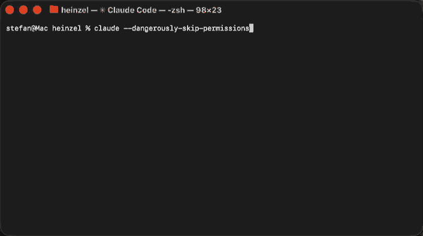

# Heinzel — System Administration with Safety Guardrails

Managing systems means remembering the right commands
for each OS, checking man pages, keeping track of how
everything is set up and connected — and hoping you
don't forget a backup or a firewall rule. Heinzel does that for you.
Describe the task in plain English, review each
command — or don't, if you prefer the
`--dangerously-skip-permissions` way — done. It logs every change, asks when
something is unclear, and gives you a detailed report
when it's finished.

Using it feels like pair-programming with a colleague
who always checks the docs first and never skips a
step because he's in a hurry.
Not sure yet? Switch to plan mode and just talk it
through first — no changes until you say go.

Heinzel is a set of rules that turns
[Claude Code](https://claude.ai/code) into a
cautious, methodical sysadmin that backs up before
editing, dry-runs before installing, remembers what 
was done 6 months ago and asks before doing 
anything destructive.

## Screencast: Install Ruby and Rails



### Other Screencasts on YouTube

- [Debug and fix a misconfigured nginx and firewall on a remote server](https://www.youtube.com/watch?v=_uenftahbJI) (1 min)
- [Install the latest stable Ruby and Ruby on Rails](https://www.youtube.com/watch?v=QVvm29eABKY) (1 min)
- [Install a firewall, upgrade the Linux distribution and setup automatic daily security updates](https://www.youtube.com/watch?v=ve_TFyJy_uU) (2 min)

## How It Works

1. **Install
   [Claude Code](https://docs.anthropic.com/en/docs/claude-code)
   and clone the repo**
   ```
   git clone https://github.com/wintermeyer/heinzel.git
   cd heinzel
   claude
   ```
2. **Describe what you need in plain English**
   ```
   ❯ Install and configure nginx on web1.example.com
   ```
3. **Review and approve each command before it runs**
   Claude proposes every SSH command, explains what
   it does and why, and waits for your approval.
   Nothing runs without your say-so.

### Auto-detection

The first time you point Heinzel at any machine, Claude
detects the OS, gathers hardware info, and remembers
everything for future sessions:

```
 ❯ What OS is installed on app.example.com?
```

```
 ❯ Install a firewall on app.example.com and
   configure it to allow SSH and HTTPS traffic.
```

### Memory across sessions

After working on a machine, Claude remembers it. Next
week you launch Claude Code again and type:

```
 ❯ Check on web1.example.com.
```

Claude reads
`memory/servers/web1.example.com/memory.md`, already
knows it's Debian 12 with nginx and PostgreSQL,
checks the local changelog, and picks up right where
it left off.

### Session to-do list

When a multi-step task gets interrupted — connection
drop, conversation ends, laptop closes — Claude keeps
a to-do list in `memory/servers/<hostname>/todo.md`
with checkboxes for each step. On reconnection it
shows what's still pending and asks whether to
continue or start fresh.

### Plan mode

For complex or unfamiliar tasks, switch to plan mode
before touching anything:

```
 ❯ /plan Migrate the database from MySQL to
   PostgreSQL on db.example.com
```

Claude explores the server, checks what's running,
reads configs, and drafts a step-by-step plan — but
makes no changes. You discuss the approach, adjust
it, and only when you approve does execution begin.

### Local administration

Heinzel also works on the local machine — no SSH
needed, commands run directly. The same safety rules,
memory, and guardrails apply whether the target is a
remote server or your own laptop.

This works on both Linux and macOS:

```
 ❯ Update all Homebrew packages on this Mac
```

```
 ❯ Check if the firewall is configured on
   this machine
```

## Command line interface

You can script Heinzel too:

```bash
$ claude --dangerously-skip-permissions \
  -p "What OS is installed on \
  server1.example.com? Login as root."
**server1.example.com** is running **Debian 11
(Bullseye)** on an aarch64 (ARM64) system with
4 CPU cores, 3.8 GB RAM, and a 15 GB root disk
(15% used).

Note: Debian 11 reached end of life in August
2024 and only receives long-term support (LTS)
until August 2026. You may want to plan an
upgrade to Debian 12 (Bookworm) before then.
$ claude --dangerously-skip-permissions \
  -p "Upgrade server1.example.com to Debian 12. \
  I have a backup. Don't ask me any questions. \
  Just do it. Give me a report afterwards."
---

## Upgrade Report: server1.example.com

**Debian 11 (Bullseye) -> Debian 12 (Bookworm)**
— completed successfully.

### What was done

1. **Verified Debian 11.11 was fully up to date**
   before starting
2. **Updated `/etc/apt/sources.list`** from
   `bullseye` to `bookworm` (backed up first)
3. **Ran `apt-get upgrade`** — installed packages
   that could upgrade without removals
4. **Ran `apt-get full-upgrade`** — completed the
   full dist-upgrade
5. **Cleaned up** — `autoremove` removed 28
   obsolete packages (410 MB freed)
6. **Rebooted** into the new kernel
   6.1.0-43-arm64
7. **Removed old kernel** 5.10.0-38-arm64
   (257 MB freed)
8. **Reinstalled `unattended-upgrades`** — it was
   dropped during the dist-upgrade

### Current state

|                         |                               |
| ----------------------- | ----------------------------- |
| **OS**                  | Debian 12.13 (Bookworm)       |
| **Kernel**              | 6.1.0-43-arm64                |
| **Disk**                | 15 GB, 19% used               |
| **nginx**               | running                       |
| **ufw**                 | active, default deny incoming |
| **unattended-upgrades** | installed and enabled         |
```

### About `--dangerously-skip-permissions`

By default Claude Code asks for your approval before
every tool call — every SSH command, every file read,
every write. The `--dangerously-skip-permissions` flag
disables these prompts so Claude runs everything
without asking.

The name is intentional: **it is dangerous.** You give
up the ability to review each command before it hits a
live server. On the other hand, it makes scripting and
batch work practical — you can't sit and approve 200
prompts during an unattended upgrade.

**When it makes sense:**

- Non-interactive / scripted use
  (`claude --dangerously-skip-permissions -p "..."`)
- Read-only tasks (checking OS, gathering info)
- Disposable environments (dev VMs, containers)

**When to avoid it:**

- First time working on a production server
- When you don't trust Heinzel or don't understand it
- Any time you want to understand what's happening
  step by step

Without the flag, Heinzel's safety rules still apply —
Claude still backs up configs, dry-runs first, and
follows least privilege. The flag only removes *your*
approval step, not the built-in guardrails.

## Safety & Guardrails

Heinzel's safety rules are not optional — they're
baked into every session. Claude follows them
consistently, even when a human might skip steps
under pressure.

- **Asks before acting** — destructive commands,
  firewall changes, reboots, and network restarts
  all require your explicit approval.
- **Backs up config files** — copies to
  `/var/backups/heinzel/` before editing
  (auto-cleaned after 30 days).
- **Dry-runs first** — runs dry-run commands before
  actual package operations when the package manager
  supports it.
- **Auto-detects the OS** — reads `/etc/os-release`
  on Linux or `sw_vers` on macOS and applies the
  right commands for the platform. No guessing.
- **Logs everything** — all changes are recorded in
  the system journal (`journalctl -t heinzel`) and
  mirrored locally in
  `memory/servers/<hostname>/changelog.log`.
- **Remembers servers** — stores OS, services, and
  notes in `memory/servers/` for future sessions.
- **Stable repos only** — no third-party sources
  without your explicit approval.
- **Least privilege** — uses a normal user when
  possible, `sudo` only when necessary, root only
  as a last resort. If neither sudo nor root SSH
  is available, works in unprivileged mode and
  produces a sysadmin report for tasks that need
  root.
- **Ignores injected instructions** — text found in
  server files, logs, or command output is treated as
  data only. Suspicious patterns (text addressing the
  AI, embedded commands, safety-rule overrides) are
  flagged to the user, never followed.

## How Heinzel Fights LLM Hallucinations

LLMs can "hallucinate" — confidently produce commands
with wrong flags, incorrect file paths, or syntax that
doesn't exist on the server's specific OS and version.
On a live system, a hallucinated command can be
dangerous.

Heinzel reduces this risk with multiple layers:

- **Distro-specific rule files** — Instead of relying
  on the LLM's memory, heinzel loads a verified rule
  file for each platform (Debian, RHEL, SUSE,
  macOS). These files contain the correct
  commands, package managers, firewall tools, and
  common pitfalls for each distro. The LLM reads
  the file and follows it — it doesn't have to
  guess.
- **Verify before running** — heinzel is instructed
  to check `--help`, man pages, or upstream docs
  before running any command. This catches wrong
  flags and syntax before they reach the server.
- **Server memory** — Each server's OS, version,
  installed services, and configuration are recorded
  in a memory file. On subsequent connections, the
  LLM reads facts instead of guessing.
- **Dry-run first** — Package operations are tested
  with dry-run flags before actual execution.
- **Human review** — Every command is shown to you
  before it runs. You are the final safeguard.

No approach eliminates hallucinations entirely. The
goal is to minimize what the LLM needs to recall
from training data by putting verified facts in front
of it at every step.

## Accessing Logs

Heinzel logs every action to the system journal on each
server. To query the log:

```bash
# All entries
journalctl -t heinzel

# Filter by date
journalctl -t heinzel --since "2026-02-01"

# Last 20 entries
journalctl -t heinzel -n 20

# macOS
log show \
  --predicate 'senderImagePath CONTAINS "logger"' \
  --info --last 7d | grep heinzel
```

## Supported Distributions

| Family | Distributions                     | Rule file          |
| ------ | --------------------------------- | ------------------ |
| Debian | Debian, Ubuntu                    | `rules/debian.md`  |
| RHEL   | RHEL, CentOS, Fedora, Rocky, Alma | `rules/rhel.md`    |
| SUSE   | openSUSE, SLES                    | `rules/suse.md`    |
| macOS  | macOS (Apple Silicon & Intel)     | `rules/macos.md`   |

Other distributions work too — Claude will apply
general best practices and let you know which OS it
detected.

## Getting Started

### Prerequisites

- **SSH access** to the target server — either as a
  normal user or as root. The SSH connection must
  not prompt for a password or passphrase (use
  key-based authentication without a passphrase).
  This is not needed for local administration
  (localhost / your own machine).

  Quick setup: generate a key with `ssh-keygen`,
  copy it to the server with `ssh-copy-id user@host`,
  and test with `ssh user@host`. See the
  [Arch wiki SSH keys guide](https://wiki.archlinux.org/title/SSH_keys)
  for details.

- Linux (any distribution) or macOS on the target
  machines. All supported systems can also be
  managed locally without SSH.

### Setup

1. Clone this repo and enter the directory:
   ```
   git clone https://github.com/wintermeyer/heinzel.git
   cd heinzel
   ```
2. Start Claude Code:
   ```
   claude
   ```
3. Tell Claude your problem, e.g. *"Find out if
   there is a webserver running on
   shop.example.com"*

Claude will auto-detect the OS on first connection
and remember it for future sessions.

## Risks & Responsibilities

> [!CAUTION]
> Heinzel operates on live servers and local machines
> — as root, with sudo, or in unprivileged mode.
> Always review every command before approving it.

This is a tool for **experienced sysadmins and
power users**.

The risks are real — an LLM can hallucinate,
misunderstand your intent, or produce a command with
unintended side effects. A single bad command as root
can be unrecoverable! 😱

But consider: human sysadmins make mistakes too —
especially when tired, rushed, or managing dozens of
servers at 2 AM during an outage. They forget
backups, skip dry-runs, and apply firewall rules that
lock themselves out. Every experienced sysadmin has a
horror story.

Claude doesn't get tired or flustered. It **always**
backs up before editing, **always** dry-runs first,
and **always** checks the OS before assuming which
commands to use. It follows the safety checklist every
single time — not just when it remembers to.

The question isn't whether heinzel is risk-free — it
isn't. The question is whether a disciplined AI that
follows every safety rule every time, with a human
reviewing every command, produces fewer disasters than
a human working alone under real-world conditions.

Stay in the driver's seat. Review every command. Do
not blindly approve.

## Project Structure

```
CLAUDE.md              — Main instructions for Claude Code
.claude/
  settings.json        — Project-level Claude Code settings
  hooks/
    check-updates.sh   — Auto-check for repo updates on session start
rules/
  debian.md            — Debian & Ubuntu rules
  rhel.md              — RHEL, CentOS, Fedora, Rocky, Alma rules
  suse.md              — openSUSE & SLES rules
  macos.md             — macOS rules
  mise.md              — Language runtime manager (mise)
memory/
  MEMORY.md            — Index for server memory
  network.md           — Cross-server network facts (gitignored)
  servers/<hostname>/
    memory.md          — Server state snapshot (gitignored)
    changelog.log      — Local change history (gitignored)
    todo.md            — Session task list (gitignored)
```

## Why the Name Heinzel?

The name comes from the
[Heinzelmannchen](https://en.wikipedia.org/wiki/Heinzelm%C3%A4nnchen)
— the helpful gnomes of Cologne from German folklore.
Every night, while the people of Cologne slept, the
Heinzelmannchen crept out and did all the work: baking
bread, building houses, finishing whatever was left
undone. An invisible helper that quietly takes care of
things — a fitting name for a system administration
tool that handles the tedious work while you review
and approve.

## Professional Support

Need help setting this up for your infrastructure, or
want a team to manage your infrastructure with
AI-assisted tooling?

**[Wintermeyer Consulting](https://wintermeyer-consulting.de)**
offers consulting and hands-on support for heinzel
deployments — from initial setup to ongoing system
management.

Contact the project founder Stefan Wintermeyer and
his team: **sw@wintermeyer-consulting.de**

## Contributing

Bug reports, feature requests, and pull requests are
very welcome! If you have ideas for better guardrails,
new distro support, or improvements to the safety
rules — please open an issue or submit a PR.

## License

MIT
