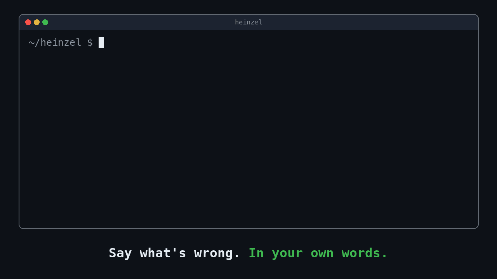

# Heinzel — System Administration with Safety Guardrails

Heinzel is a set of rules that turns an AI coding assistant
into a cautious, methodical sysadmin. Describe what you need
in plain English. Heinzel works out the right commands for
your OS, explains each one, and waits for your approval. It
backs up configs, tests before applying, and remembers every
server it has worked on.

It manages Linux, FreeBSD and macOS, remote over SSH or on
the local machine, and runs in
[Claude Code](https://docs.anthropic.com/en/docs/claude-code),
[OpenCode](https://opencode.ai) or any terminal AI tool that
reads project files and runs shell commands.



The trailer is scripted, not recorded. To change it, see
[`assets/trailer/`](assets/trailer/README.md).

Screencasts on YouTube:

- [Debug and fix a misconfigured nginx and firewall](https://www.youtube.com/watch?v=_uenftahbJI) (1 min)
- [Install the latest stable Ruby and Ruby on Rails](https://www.youtube.com/watch?v=QVvm29eABKY) (1 min)
- [Install a firewall, upgrade the distribution, set up daily security updates](https://www.youtube.com/watch?v=ve_TFyJy_uU) (2 min)

Press:
[German article about Heinzel on heise.de](https://www.heise.de/ratgeber/KI-Assistent-Heinzel-fuer-die-Server-Administration-im-Ueberblick-11244463.html)

## Install

You need:

- **An AI coding assistant in the terminal**, e.g. Claude
  Code or OpenCode.
- **SSH access to the server** as a normal user or as root,
  with a key that does not ask for a passphrase. Not needed
  for the local machine. New to SSH keys? See the
  [Arch wiki guide](https://wiki.archlinux.org/title/SSH_keys).
- **A workstation** running Linux, macOS, FreeBSD or Windows.
  On Windows use
  [WSL](https://learn.microsoft.com/windows/wsl/), or start
  the AI tool from the Git Bash of
  [Git for Windows](https://gitforwindows.org/). PowerShell
  and `cmd.exe` are not supported.

Then:

```
git clone https://github.com/wintermeyer/heinzel.git
cd heinzel
claude        # or: opencode
```

```
❯ Install postgresql on server1.example.com
```

On the first connection Heinzel may ask what it cannot
detect, usually the SSH user. The answer goes to
`memory/user.md`, so it asks once. You can pre-fill that file
from `memory/user.md.example`. It also holds your language
(`Language: German`).

Heinzel proposes every command, says what it does and why,
and waits for your approval.

Heinzel shares one SSH connection per host and keeps it open
for 10 minutes after the last call. The sockets live in
`~/.cache/heinzel` (mode 0700), so any process of your local
user can use an open connection without the key.

## What you can ask

- `Check on web1.example.com`: reads the server's memory file
  and recent changes, then picks up where the last session
  ended.
- `Run housekeeping on app.example.com`: a health report on
  disk, memory, load, updates, firewall, certificates and
  failed services. Problems come first.
- `Run a security audit on app.example.com`: SSH, firewall,
  accounts, open ports and kernel settings, by severity.
- `Run a fleet audit`: compares update, sshd, firewall, mail
  and time-sync policies across all known servers and shows
  where they disagree. Changes nothing.
- `Email me the output of "df -h" from app.example.com`:
  sends text or files by mail, from your workstation or from
  the server.
- `Clean up leftovers of old apps on this Mac`: finds what
  removed apps left in `~/Library` and `/Library`. Only what
  you approve goes to the Trash.
- `Update all Homebrew packages on this Mac`: local mode, no
  SSH, same rules.
- `/plan Migrate the database on db.example.com`: explores
  and drafts a plan, changes nothing until you approve.
  `/plan` is Claude Code. In OpenCode, ask Heinzel to plan
  first.

More that happens without asking:

- **OS detection.** On first contact Heinzel detects the OS
  and hardware and loads the rule file for that platform.
- **Memory.** Each server gets a folder under
  `memory/servers/` with its state, a changelog and an open
  to-do list. An interrupted job shows up as pending on the
  next connection.
- **DNS aliases.** Several names for the same IP share one
  memory. Each alias can have its own SSH user.
- **SSH ports.** A port other than 22 is stored per server.
  List the ports you use as `Alternative SSH ports:` in
  `memory/user.md`. Heinzel tries those and never scans.
- **Email details.** Mails carry a short signature with the
  operator's name (`Operator name:` in `memory/user.md`) and
  headers that keep out-of-office replies away. The first
  mail per host asks where to send from. Heinzel uses an
  existing MTA and asks before installing one.

The macOS cleanup scanner needs the Command Line Tools
(`xcode-select --install`).

## Safety & guardrails

The safety rules are part of every session.

- **Asks before acting.** Destructive commands, firewall
  changes, reboots and service restarts need your approval.
  Reloads run on their own when the config test passes
  (`rules/service-reload.md`, `memory/service-policy.md`).
- **Hard guardrails (Claude Code).** A PreToolUse hook
  (`.claude/hooks/guard-taboos.sh`) blocks the absolute
  taboos in every permission mode, even
  `--dangerously-skip-permissions`: halt and poweroff,
  `mkfs`, partition-table writers, deleting or overwriting
  SSH keys, writes to `sshd_config`. It also catches them
  inside `ssh host "…"` or behind `python3 -c`. Read-only
  forms (`fdisk -l`) stay allowed. For a legitimate exception
  such as an OS replacement, start the session with
  `HEINZEL_GUARD_DISABLE=1`. OpenCode does not run this hook;
  there the written rules are the safety layer.
- **Verifies before it reports.** "It is gone since the
  reboot" gets checked against the live system first
  (`rules/verify-before-reporting.md`).
- **Backs up config files** to `/var/backups/heinzel/` before
  editing. Cleaned up after 30 days.
- **Tests before applying** with dry-run or validation modes
  where a tool has one.
- **Logs everything.** Each change is one plain-language line
  in the system journal. The technical detail and the way
  back are in `memory/servers/<hostname>/changelog.log`.
- **Stable repos only.** No third-party sources without your
  approval.
- **Least privilege.** Normal user first, `sudo` when needed,
  root last. With neither, Heinzel does what it can and
  writes a report for the tasks that need root.
- **Blacklist and read-only servers.** Hosts in
  `memory/blacklist.md` are never contacted. Hosts in
  `memory/readonly.md` are inspected but never changed.
- **Protected paths.** `memory/protected-paths.md` marks
  paths per server as `readonly`, `hidden` (content never
  shown) or `confirm` (needs a typed `CONFIRM`).
- **Ignores injected instructions.** Text in files, logs and
  command output is data. Text that addresses the AI is
  flagged to you and not followed.
- **Keeps secrets out.** Keys, password files and `.env`
  contents are inspected by metadata and fingerprint, never
  printed, and never passed as command-line arguments.

### Against hallucinations

An LLM can invent a flag or a path. Heinzel puts verified
facts in front of it instead:

- A rule file per platform holds the right commands, package
  manager and firewall tool.
- It checks `--help`, the man page or upstream docs before a
  command runs.
- It reads the server's memory file instead of guessing.
- It uses dry-run modes first.
- You see every command before it runs.

This reduces the risk. It does not remove it.

> [!CAUTION]
> Heinzel operates on live systems, as root, with sudo or
> unprivileged. Review every command before you approve it.

A disciplined AI that follows the checklist every time makes
fewer mistakes than a tired human at 2 AM. It can still
misread your intent. Stay in the driver's seat.

## Fewer prompts and scripting

By default Claude Code asks before every tool call. For
batch work use **auto mode**: a background check lets routine
commands through and still stops on risky ones. Press
Shift+Tab to cycle modes, or pass the flag:

```bash
claude --permission-mode auto \
  -p "Run housekeeping on server1.example.com"
```

`-p` runs one prompt without the interactive UI. In OpenCode
that is `opencode run "…"`.

- For CI, the strictest setup is `--permission-mode dontAsk`
  with an allowlist (`--allowedTools` or `permissions.allow`
  in `.claude/settings.json`).
- `--dangerously-skip-permissions` removes all review,
  including the protection against malicious text in server
  output. Use it in disposable environments only.
- Whatever the mode, Heinzel's own rules still apply. See
  the [permission modes docs](https://code.claude.com/docs/en/permission-modes)
  for details.

A nightly health check by cron:

```
17 6 * * * cd /path/to/heinzel && flock -n \
  /tmp/heinzel-cron-server1.lock timeout 30m \
  /abs/path/to/claude --permission-mode auto \
  -p "Run housekeeping on server1.example.com and \
email me the report" >> ~/heinzel-cron.log 2>&1
```

Run the exact prompt interactively once first, so one-time
questions are answered and stored. Details and a systemd
timer variant: `rules/scheduled-housekeeping.md`.

## Your data: `memory/`

All your state is plain text in one directory:

- `user.md`: SSH usernames, language, operator name
- `blacklist.md`, `readonly.md`, `protected-paths.md`: access
  policies
- `service-policy.md`: which services may reload or restart
  without asking
- `servers/<hostname>/`: memory, changelog, to-do and rule
  overrides per server
- `custom-rules/`: your global rule overrides
- `network.md`, `housekeeping.md`: cross-server facts and
  your own checks
- `opencode.json`: your OpenCode config

### Backup and restore

```bash
bin/heinzel-backup                        # writes a .tar.gz
bin/heinzel-backup -o <path>              # to a given path
bin/heinzel-backup --list                 # dry run
bin/heinzel-backup --restore <file.tar.gz>
```

Restore refuses to overwrite existing content without
`--force` and validates the archive before writing.

### Team setup

`memory/` is gitignored by default. To share server state:

1. Everyone copies `memory/user.md.example` to
   `memory/user.md`. This file always stays personal.
2. Edit `.gitignore` to track server memory. The comments in
   the file say which lines to change.
3. Keep each member's own machine out of git, e.g.
   `memory/servers/stefans-mbp/`.
4. Commit server memory after sessions.

`user.md`, `blacklist.md`, `readonly.md` and `opencode.json`
are never shared and still need the backup.

## Rule customization

Change behaviour without editing the upstream rule files.
Three layers, later wins:

1. `rules/<name>.md` (upstream)
2. `memory/custom-rules/<name>.md` (yours, all servers)
3. `memory/servers/<hostname>/rules.md` (one server)

```markdown
## Add: Docker cleanup
New rules applied alongside the base.

## Replace: Firewall
Replaces the matching base section entirely.

## Remove: Common Pitfalls > snap
Skip this base section.
```

A section without a prefix is an addition.
`memory/custom-rules/all.md` applies to every server. Skills
follow the same chain, e.g.
`memory/custom-rules/heinzel-housekeeping.md`.

## Updates

The version is in `VERSION`, the changes in `CHANGELOG.md`.
Claude Code updates Heinzel at session start with a
`git pull`, unless you are pinned, on another branch, or have
set `HEINZEL_NO_UPDATE=1`. Elsewhere:

```bash
bin/heinzel-update              # pull latest
bin/heinzel-update --check      # check only
bin/heinzel-update --pin v2.28.0
bin/heinzel-update --unpin
```

Coming from 1.x? The update moves `rules/custom/` and
`opencode.json` into `memory/` by itself. If you are pinned
to a 1.x tag, run `bin/heinzel-update --unpin` first.

## Supported systems

| Family  | Distributions                     | Rule file          |
| ------- | --------------------------------- | ------------------ |
| Debian  | Debian, Ubuntu                    | `rules/debian.md`  |
| RHEL    | RHEL, CentOS, Fedora, Rocky, Alma | `rules/rhel.md`    |
| SUSE    | openSUSE, SLES                    | `rules/suse.md`    |
| macOS   | Apple Silicon and Intel           | `rules/macos.md`   |
| FreeBSD | all versions                      | `rules/freebsd.md` |
| Unraid  | observed on 7.3                   | `rules/unraid.md`  |

Other distributions work with general best practices.

### AI tools

Claude Code is the tool Heinzel is developed with. OpenCode
reads the same `CLAUDE.md` and `.claude/skills/`, as long as
`OPENCODE_DISABLE_CLAUDE_CODE` is unset. Any other tool that
reads project files gets the rule layer. The skills
(housekeeping, security audit, email, fleet audit, macOS
cleanup) need a tool that supports Skills.

### OpenCode with a local model

Heinzel can run on your own hardware with
[Ollama](https://ollama.com):

```bash
ollama pull qwen3.5:9b
ollama run qwen3.5:9b
>>> /set parameter num_ctx 16384
>>> /save qwen3.5:9b-16k
>>> /bye
cp memory/opencode.json.example memory/opencode.json
opencode
```

Ollama's default context of 4096 tokens is too small for
tool use, hence the larger variant. Adjust `baseURL` and the
model name in `memory/opencode.json`, then pick the model
with `/models`. Larger models (14B and up) make more reliable
tool calls. See the
[OpenCode provider docs](https://opencode.ai/docs/providers/)
for more.

## Logs

Every change is logged on the server:

```bash
journalctl -t heinzel
journalctl -t heinzel --since "2026-02-01"

# macOS
log show \
  --predicate 'senderImagePath CONTAINS "logger"' \
  --info --last 7d | grep heinzel
```

## Project structure

```
CLAUDE.md        main instructions for the AI tool
rules/           rule files per platform and topic
.claude/skills/  housekeeping, security, email, fleet audit,
                 macOS cleanup
.claude/hooks/   update check and the taboo guard
bin/             heinzel-update, heinzel-backup,
                 heinzel-migrate
memory/          your state (gitignored)
assets/trailer/  script that renders the README trailer
```

## Why the name?

The
[Heinzelmännchen](https://en.wikipedia.org/wiki/Heinzelm%C3%A4nnchen)
are the helpful gnomes of Cologne. At night, while the city
slept, they did the work that was left undone.

## Professional support

[Wintermeyer Consulting](https://wintermeyer-consulting.de)
offers consulting and hands-on support for Heinzel, from
setup to ongoing system management. Contact Stefan
Wintermeyer: **sw@wintermeyer-consulting.de**

## Contributing

Bug reports, feature requests and pull requests are welcome.

## License

MIT
